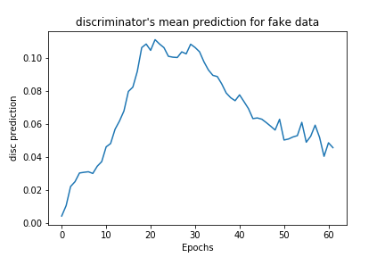

# DCGANs
Deep Convolutional Generative Adversarial Network on Celebrity Faces Dataset 

# Dataset
CelebA

# Results

## Generated Images Through Training

Epoch 1           |  Epoch 3
:-------------------------:|:-------------------------:
  |  

Epoch  21           |  Epoch 62
:-------------------------:|:-------------------------:
  |  

## Discrimnator and Generator losses

Generator           |  Discriminator
:-------------------------:|:-------------------------:
  |  

## Dicriminator's mean prediction on real and on generated data

Real Images           |  Fake Images
:-------------------------:|:-------------------------:
  |  

